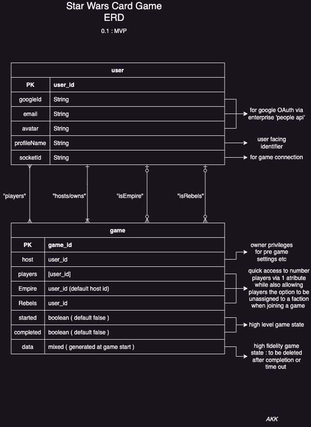
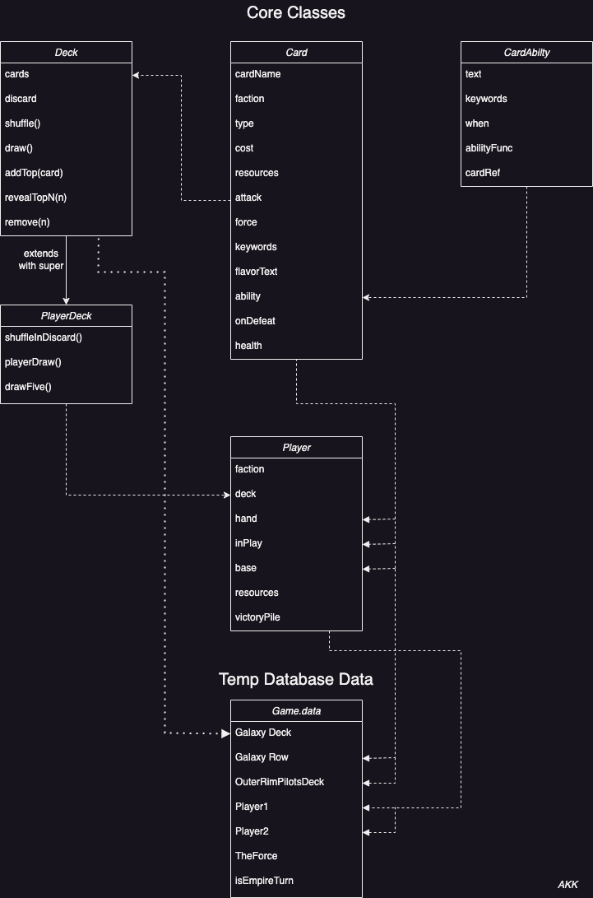
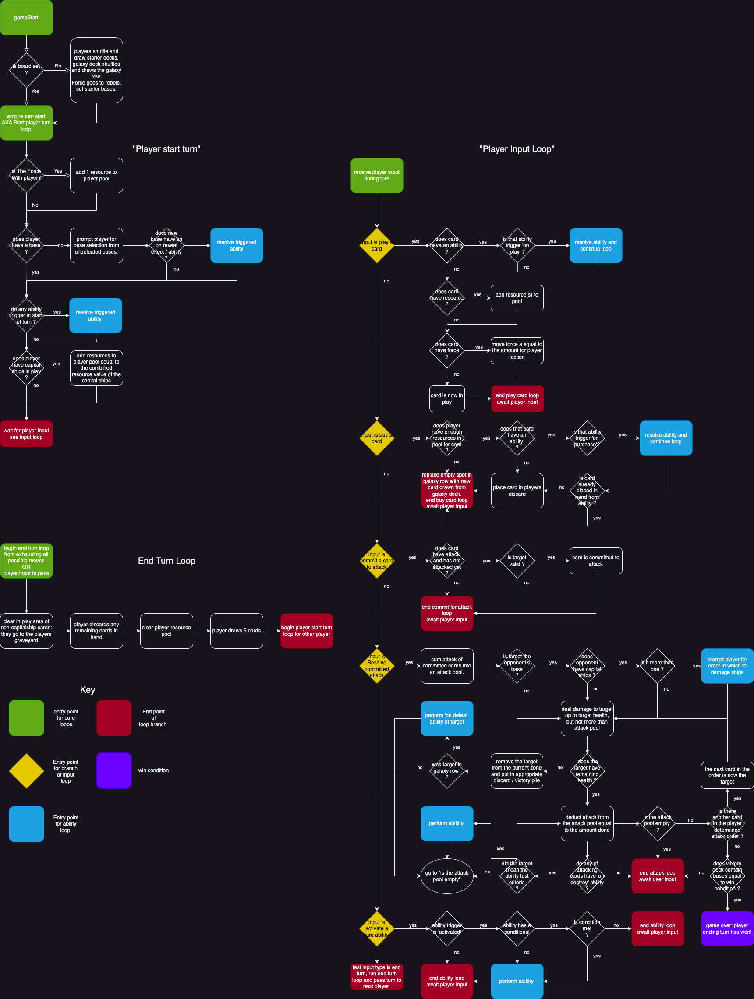

# SWCG API V~0.5~
by Andrew Kidd-Kestler

---

This is a passion project based on the deck building card game designed by Caleb Grace and made by Fantasy Flight Games. As the oldest of 5 boys who all love Star Wars and card games this game could easily be one of our favorites except that we have to be in person ! The solution is clearly to make an online version so we can enjoy this great game despite now living apart! 

The current State of the app is very much still in development but am fast approaching MVP 1.0! It is designed tp be consumed by the also work in progress SWCG Client, a React based SPA using socketIoClient. It's inclusion on my portfolio is to provide insight into my development process, a sample of my 'coding voice', CI/CD, and my problem solving chops along the way. 

If you are interested in contributing, or just want to poke around please check out the planning docs below, the [trello board](https://trello.com/b/ZNXdzSW1/sw-deck-builder-card-game-project), the client app,  and the 'Getting Started' section at the end of this page. 

---
## Technology used
* node
* express
* mongoDB Atlas
* socketIo
* mongoose
* dotenv
* cors
---
## ERD
Our entities are fairly straight forward with a user and game schema, however we do have some complexity with 4 different ways they are related. 
>Google Id and avatar have been cut from MVP 1.0, OAuth shouldn't favor 1 platform and isn't necessary to the core of the app. 

---
## Core Classes
a description fo the classes and how they are related to each other purely for a game logic standpoint (to be templated data that is not persisted, see `data` of the ERD game model)

---
## Game Loop Flow Chart
a description of the core game loops in teh for of a flow chart for those unfamiliar with the game and how to play. Includes Key.

---
## Endpoints

#### user-routes

| route | response-verb, response-object?, ack ?  |
| --- | --- |
| signup | 'signupSuccess', user{} | 
| signin | 'signinSuccess', user{} |
| signout | 'signoutSuccess', ack:{ status: 'ok' }   |
| changePassword | 'changePasswordSuccess', ack:{ status: 'ok' } |
| changeProfileName | 'changeProfileNameSuccess', ack:{ status: 'ok' } |

#### game-routes

| route | response-verb, response-object?, ack ?|
| --- | --- |
| createGame | 'createGameSuccess', game{} | 
| getGame | x |
| getOpenGames| ack{ status: 'ok', games: games } |
| joinGame | ack{ status: 'ok', message: 'joined game', game: game } |
| leaveGame | ack{ status: 'ok'} |
| deleteGame| ack{ status: 'ok' } |
| startGame| ack{ status: 'ok', data: game } |
| selectFaction | x |
| playCard | x |
| promptPlayer | x |
| passTurn | x |

---
## Getting Started 

Want to poke around and use this for your own purposes ? Maybe make a contribution? This is for you. 
1. Make your own copy and install dependencies : Please begin with a Fork and Clone to your native machine, and install dependencies ( I have used npm here) 
2. Connect to the database : Log into your mongoDB atlas account and get your URI connection string. The included `database.js` file in the config file requires us to set up a new `.env` file with a key of `DATABASE_URI`. To make sure that the collections for this app aren't conflicting with any preexisting ones add `/swcgApp` to the end of your connection string, when mongoDB connects it will make a new collection under that name because it's cool like that.
3. Spin up our API: Now that we've set up our database connection let launch the application locally, I have used nodemon for ease of development over traditional node and included it use in the start script `npm run start`. If you do not have nodemon installed globally you can install it with `npm i nodemon` or start the app with node via `node server.js`. When it is spun up and properly connected we will get 2 logs, one form `server.js `listing the port number (3000), and one from `connection.js` confirming our connection to the Atlas server.
4. Front End: ! Time to go checkout the front end app for this application also available on github and get coding / playing :smile: